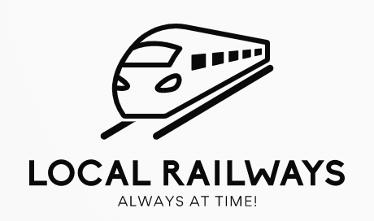
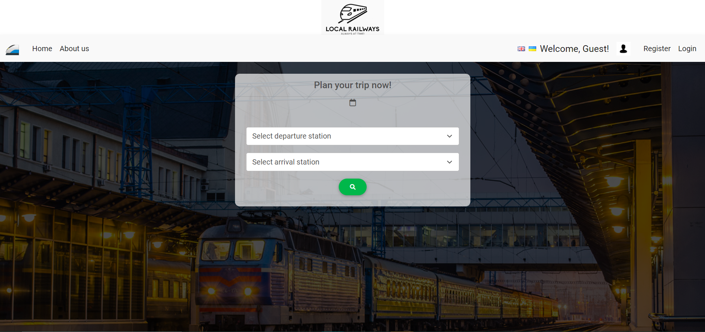
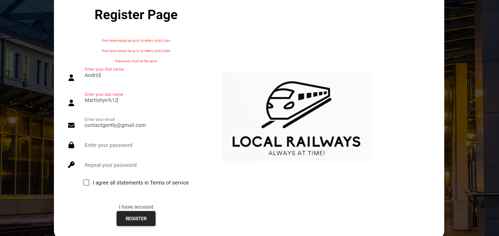
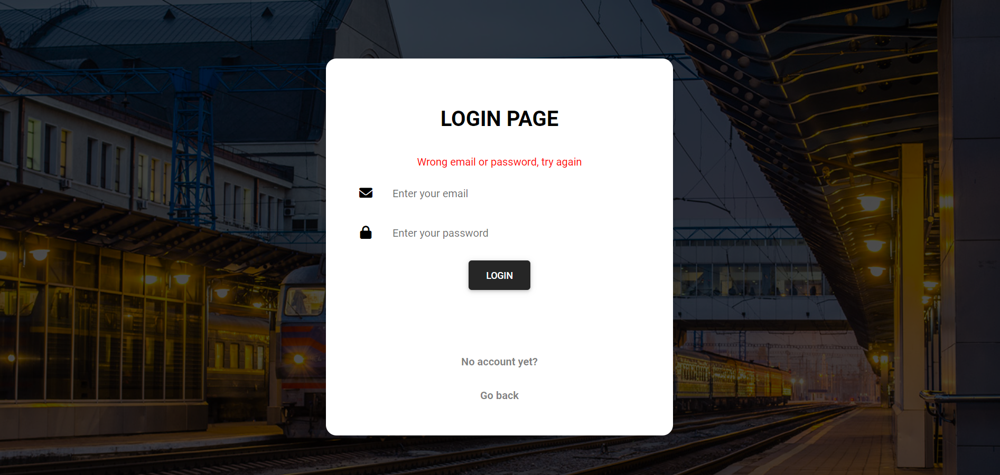

<h1 align="center">Local Railways</h1> 

## Table of Contents

- [Introduction](#introduction)
- [Functionality](#functionality)
- [Technologies](#technologies)
- [Workflow](#workflow)

## Introduction

Self-study project. You can check booking for certain route and buy ticket. Admin may change some parts of the route details.

## Technologies

- Java 8+
- Spring Boot + Spring Data
- Spring Security
- MySQL relational database
- Embedded Tomcat within Spring Boot
- Junit 5 + Mockito Api
- Sl4f logging aspect
- Maven as building project tool
- BootStrap + Thymeleaf + HTML + CSS

## Functionality

In project 2 roles are defined : Admin, Customer. Default data from database is admin credentials and train entity.
Based on roles there are assigned functionality. Admin is has the following functionality :
- able to create and delete Route entity
- able to add, update, delete RoutePoint entity, that is a part of Route
- able to add, update,delete Wagon entity, that is a part of Route
- able to add, update, delete Station entity, that is a part of RoutePoint
- able to edit(without password), delete User entity
- able to see active orders from Users

Customer has the following functionality:
- able to search Route based on departure and arrival stations
- check found Route(s) schedules
- proceed to ticket booking page
- book ticket and be able to pay or cancel booking
- been able to get qr code and link to download ticket in pdf once payed
- able to check "about me" page when clicking on avatar

Guest has the following functionality:
- able to search Route based on departure and arrival stations
- check found Route(s) schedules
- login and register, to be able to perform booking (booking requires authorization)

Independent features:
- email is send when to user when following actions made: registration, booking, paying, or cancelling ticket
- 2 languages (UA/ENG)
- input data validation

## Workflow

- Main Page

- Registration Page with front-back validation

- Login Page with front-back validation

